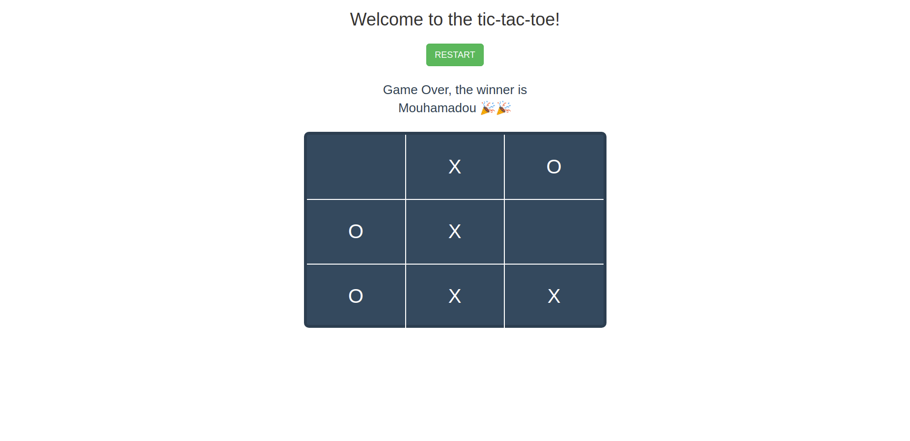

# Tic Tac Toe App
> A Tic Tac Toe Game 

## Technologies

- HTML
- CSS
- JavaScript
- Webpack

## Live Version 
Play the live version <a href="https://mouhadiouf.github.io/tic-tac-toe-JS/" > here </a>

## How To Play The Game 
The game is developed with Webpack. You need to launch it with a live server.

## Functionalities

Can be found on: ( <a href="https://www.theodinproject.com/courses/javascript/lessons/tic-tac-toe-javascript"> The Odin Library Project </a>)

The user can:

- Play the game with another user
- Choose a side (X or O)
- Restart the game anytime

## Developed by

Mouhamadou Diouf ( <a href="https://github.com/MouhaDiouf"> @mouhad </a>)
Michael Damulak (<a href="https://github.com/em-em-D"> @emmd </a>)

## Contributing

1. Fork it (https://github.com/MouhaDiouf/tic-tac-toe-JS)
2. Create your feature branch (git checkout -b feature/[choose-a-name])
3. Commit your changes (git commit -am 'What this commit will fix/add')
4. Push to the branch (git push origin feature/[chosen name])
5. Create a new Pull Request
